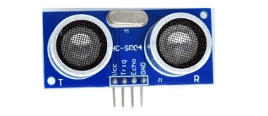
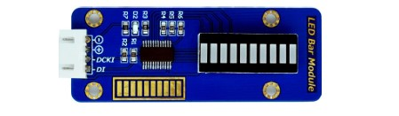

# Features

The smart waste management system we've created uses sensors and IoT technology to keep track of how full trash containers are. We use an ultrasonic sensor to measure waste levels accurately, taking into account the container's depth. This information is displayed in real-time on a user-friendly screen created with Tkinter. Users can also set a threshold (like 80% full) to get alerts when the container needs attention.

Outside the container, there's an LED bar that changes to show how full the container is. For example, if it's 0-20% full, one bar lights up; if it's 21-40% full, two bars light up, and so on. This visual display makes it easy to see the waste level at a glance.

To access the container, there's a security system with red and blue buttons. Users need to press a specific sequence (BLUE-RED-BLUE) within 4 seconds to unlock it. LED lights show if they get the sequence right (green) or wrong (red).

If someone tries to open the locked container, a buzzer sounds, and a warning appears on the screen. The buzzer stops once the container is securely closed. This system helps manage waste efficiently and keeps the container secure from unauthorized access.

# Circuit Diagram
 

## Components:
  - Rasberry Pi
    
  - Ultrasonic sensor (HC-SR04)
    
  - LED bar display
    
  - Green and Red Leds
    
  - Red and blue push buttons
    
  - Passive buzzer
    
  - Breadboard (for prototyping and connecting components)
  - Jumper wires (for connecting components on the breadboard)
  - trash container
    
# Image of the Elements with the  jumper wire connections

# A close look to the GPIO connections with the  elements

# graph design

  
